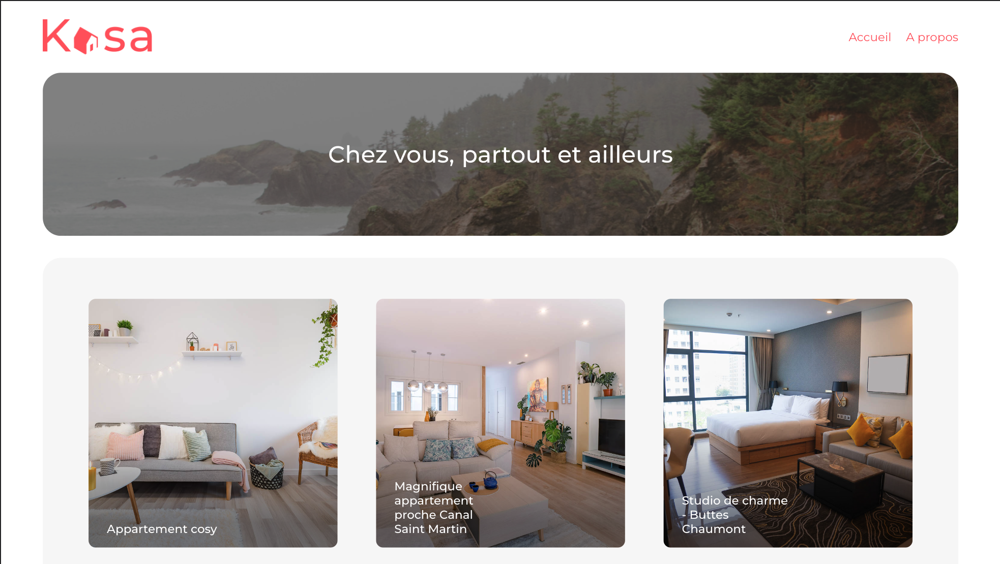

# Getting Started with Create React App

Projet 7 : Kasa - Agence de location immobilière

## Available Scripts

In the project directory, you can run:

### `Installing dependancies`

From Back run "npm install"
From React App run "yarn"

### `Run Back-End`

In the terminal from back's folder run "nodemon"

### `yarn start`

Runs the app in the development mode.\
Open [http://localhost:3000](http://localhost:3000) to view it in your browser.

The page will reload when you make changes.\
You may also see any lint errors in the console.